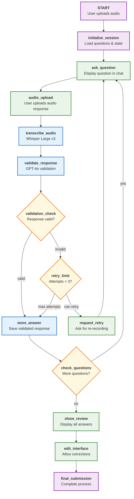

# MVP Plan: Voice Interview System

## MVP Simplifications

For the MVP, we'll remove the dual ASR approach and real-time validation to focus on core functionality:

### Removed for MVP:
- ❌ Real-time ASR (Whisper Turbo)
- ❌ Real-time validation with GPT-4o mini
- ❌ Complex conversation flow decisions
- ❌ Phone call integration
- ❌ Streaming TTS

### MVP Core Features:
- ✅ Chat interface integration (existing langchain agent-chat-ui)
- ✅ Sequential question flow
- ✅ Single high-quality ASR (Whisper Large v3)
- ✅ Single validation model (GPT-4o)
- ✅ Pydantic field validation
- ✅ Simple conversation management
- ✅ Human review interface

## Simplified Architecture



## MVP Implementation Plan

### Phase 1: Core Infrastructure (Week 1)
1. **Setup LangGraph with Chat Interface**
   - Integrate with existing langchain agent-chat-ui
   - Configure state management with simple in-memory storage
   - Setup basic question loading

2. **Implement Basic Nodes**
   - `initialize_session`
   - `ask_question` 
   - `check_questions`

### Phase 2: Audio Processing (Week 2)
1. **Audio Upload Integration**
   - File upload component in chat UI
   - Audio format validation
   - Basic audio preprocessing

2. **ASR Integration**
   - OpenAI Whisper Large v3 integration
   - Error handling for transcription failures

### Phase 3: Validation System (Week 3)
1. **Pydantic Models**
   - Question definitions
   - Validation rules
   - Response schemas

2. **GPT-4o Validation**
   - Single validation node
   - Structured output parsing
   - Retry logic

### Phase 4: User Interface (Week 4)
1. **Review Interface**
   - Display all Q&A pairs
   - Edit functionality
   - Final submission

2. **Error Handling & Polish**
   - User feedback messages
   - Progress indicators
   - Basic error recovery

## Simplified Data Models

```python
from pydantic import BaseModel, Field
from typing import Optional, List, Dict
from enum import Enum
import uuid

class QuestionType(str, Enum):
    TEXT = "text"
    BOOLEAN = "boolean"
    POLICY_NUMBER = "policy_number"
    EMAIL = "email"

class ValidationResult(BaseModel):
    is_valid: bool
    extracted_value: Optional[str] = None
    confidence: float
    issues: List[str] = []

class Question(BaseModel):
    id: str
    text: str
    field_type: QuestionType
    validation_prompt: str
    required: bool = True
    max_retries: int = 3

class MVPState(BaseModel):
    session_id: str = Field(default_factory=lambda: str(uuid.uuid4()))
    current_question_index: int = 0
    questions: List[Question] = []
    answers: Dict[str, str] = {}
    validation_results: Dict[str, ValidationResult] = {}
    retry_counts: Dict[str, int] = {}
    audio_file_path: Optional[str] = None
    transcription: Optional[str] = None
    is_complete: bool = False
```

## MVP Node Implementation

### Core Nodes

```python
from langgraph.graph import StateGraph, END

def initialize_session_node(state: MVPState) -> MVPState:
    """Load predefined questions for the interview"""
    questions = [
        Question(
            id="full_name",
            text="Please record your full name",
            field_type=QuestionType.TEXT,
            validation_prompt="Extract the person's full name. Must include first and last name."
        ),
        Question(
            id="policy_number", 
            text="Please record your policy number",
            field_type=QuestionType.POLICY_NUMBER,
            validation_prompt="Extract policy number. Format: 2 letters + 6-10 digits (e.g., AB1234567)"
        ),
        Question(
            id="has_dependents",
            text="Do you have dependents on your policy? Please answer yes or no",
            field_type=QuestionType.BOOLEAN,
            validation_prompt="Extract yes/no answer about having dependents. Return 'true' or 'false'."
        )
    ]
    
    return MVPState(
        session_id=state.session_id,
        questions=questions,
        current_question_index=0,
        answers={},
        validation_results={},
        retry_counts={}
    )

def ask_question_node(state: MVPState) -> MVPState:
    """Display current question in chat interface"""
    if state.current_question_index >= len(state.questions):
        return {**state, "is_complete": True}
    
    current_question = state.questions[state.current_question_index]
    
    # This will be displayed in the chat UI
    return {
        **state,
        "current_question": current_question.text,
        "waiting_for_audio": True
    }

async def transcribe_audio_node(state: MVPState) -> MVPState:
    """Transcribe uploaded audio using Whisper Large v3"""
    if not state.audio_file_path:
        return {**state, "error": "No audio file provided"}
    
    try:
        # Use OpenAI Whisper API
        with open(state.audio_file_path, "rb") as audio_file:
            transcript = await openai.audio.transcriptions.create(
                model="whisper-1",  # This uses Large v3 under the hood
                file=audio_file,
                response_format="text"
            )
        
        return {**state, "transcription": transcript}
        
    except Exception as e:
        return {**state, "error": f"Transcription failed: {str(e)}"}

async def validate_response_node(state: MVPState) -> MVPState:
    """Validate transcribed response using GPT-4o"""
    current_question = state.questions[state.current_question_index]
    
    response = await openai.chat.completions.create(
        model="gpt-4o",
        messages=[
            {
                "role": "system", 
                "content": f"""
                {current_question.validation_prompt}
                
                Return JSON format:
                {{
                    "is_valid": boolean,
                    "extracted_value": "cleaned value or null", 
                    "confidence": 0.0-1.0,
                    "issues": ["list any issues"]
                }}
                """
            },
            {
                "role": "user",
                "content": f"Question: {current_question.text}\nUser response: {state.transcription}"
            }
        ],
        response_format={"type": "json_object"}
    )
    
    validation_result = ValidationResult.parse_raw(response.choices[0].message.content)
    
    return {
        **state,
        "validation_results": {
            **state.validation_results,
            current_question.id: validation_result
        }
    }

def validation_check(state: MVPState) -> str:
    """Check if validation passed"""
    current_question = state.questions[state.current_question_index]
    validation_result = state.validation_results[current_question.id]
    
    if validation_result.is_valid and validation_result.confidence > 0.7:
        return "valid"
    else:
        return "invalid"

def store_answer_node(state: MVPState) -> MVPState:
    """Store the validated answer"""
    current_question = state.questions[state.current_question_index]
    validation_result = state.validation_results[current_question.id]
    
    # Store the answer (use extracted_value if valid, otherwise raw transcription)
    answer_value = validation_result.extracted_value if validation_result.is_valid else state.transcription
    
    return {
        **state,
        "answers": {
            **state.answers,
            current_question.id: answer_value
        },
        "current_question_index": state.current_question_index + 1
    }

def check_questions(state: MVPState) -> str:
    """Check if more questions remain"""
    if state.current_question_index >= len(state.questions):
        return "no"
    else:
        return "yes"
```

### LangGraph Setup

```python
# Create the workflow
workflow = StateGraph(MVPState)

# Add nodes
workflow.add_node("initialize_session", initialize_session_node)
workflow.add_node("ask_question", ask_question_node)
workflow.add_node("transcribe_audio", transcribe_audio_node)
workflow.add_node("validate_response", validate_response_node)
workflow.add_node("store_answer", store_answer_node)

# Add conditional edges
workflow.add_conditional_edges(
    "validate_response",
    validation_check,
    {
        "valid": "store_answer",
        "invalid": "ask_question"  # Retry same question
    }
)

workflow.add_conditional_edges(
    "store_answer",
    check_questions,
    {
        "yes": "ask_question",
        "no": END
    }
)

# Set entry point
workflow.set_entry_point("initialize_session")

# Compile
app = workflow.compile()
```

## Chat UI Integration

### Frontend Components (React/TypeScript)

```typescript
// AudioUpload.tsx
import React, { useState } from 'react';

interface AudioUploadProps {
  onAudioUpload: (file: File) => void;
  currentQuestion: string;
}

export const AudioUpload: React.FC<AudioUploadProps> = ({ 
  onAudioUpload, 
  currentQuestion 
}) => {
  const [recording, setRecording] = useState(false);
  const [mediaRecorder, setMediaRecorder] = useState<MediaRecorder | null>(null);

  const startRecording = async () => {
    const stream = await navigator.mediaDevices.getUserMedia({ audio: true });
    const recorder = new MediaRecorder(stream);
    
    recorder.ondataavailable = (event) => {
      const audioBlob = new Blob([event.data], { type: 'audio/wav' });
      const audioFile = new File([audioBlob], 'response.wav', { type: 'audio/wav' });
      onAudioUpload(audioFile);
    };
    
    setMediaRecorder(recorder);
    recorder.start();
    setRecording(true);
  };

  const stopRecording = () => {
    mediaRecorder?.stop();
    setRecording(false);
  };

  return (
    <div className="audio-upload">
      <h3>{currentQuestion}</h3>
      <button 
        onClick={recording ? stopRecording : startRecording}
        className={recording ? 'recording' : 'ready'}
      >
        {recording ? 'Stop Recording' : 'Start Recording'}
      </button>
    </div>
  );
};
```

### Backend Integration

```python
# FastAPI endpoint for chat UI
from fastapi import FastAPI, UploadFile, File
from langchain.callbacks import StreamingStdOutCallbackHandler

app = FastAPI()

@app.post("/interview/upload-audio")
async def upload_audio(
    session_id: str,
    audio_file: UploadFile = File(...)
):
    # Save uploaded file
    file_path = f"temp/{session_id}_{audio_file.filename}"
    with open(file_path, "wb") as buffer:
        buffer.write(await audio_file.read())
    
    # Update state with file path
    current_state = get_session_state(session_id)
    current_state.audio_file_path = file_path
    
    # Run LangGraph workflow
    result = await app.ainvoke(
        current_state,
        {"configurable": {"thread_id": session_id}}
    )
    
    return {
        "transcription": result.transcription,
        "validation_result": result.validation_results.get(
            result.questions[result.current_question_index - 1].id
        ),
        "next_question": result.current_question if not result.is_complete else None,
        "is_complete": result.is_complete
    }
```

## MVP Timeline & Milestones

### Week 1: Foundation
- [ ] Setup LangGraph with basic state management
- [ ] Integrate with existing chat UI
- [ ] Implement question loading and basic flow
- [ ] Test basic navigation between questions

### Week 2: Audio Processing  
- [ ] Add audio upload functionality to chat UI
- [ ] Integrate OpenAI Whisper API
- [ ] Handle audio file management
- [ ] Test transcription accuracy

### Week 3: Validation
- [ ] Implement GPT-4o validation
- [ ] Add Pydantic models for structured responses
- [ ] Handle validation failures and retries
- [ ] Test different question types

### Week 4: Polish & Deploy
- [ ] Add review interface showing all answers
- [ ] Implement edit functionality
- [ ] Add error handling and user feedback
- [ ] Deploy MVP for testing

## Success Criteria for MVP

1. **Functional**: Users can complete a 3-question interview via chat interface
2. **Accurate**: Whisper transcription works reliably for clear audio
3. **Validated**: GPT-4o correctly validates different field types
4. **User-Friendly**: Clear error messages and retry functionality
5. **Deployable**: Runs stably in production environment

This MVP removes complexity while maintaining the core value proposition: automated voice interviews with AI validation.