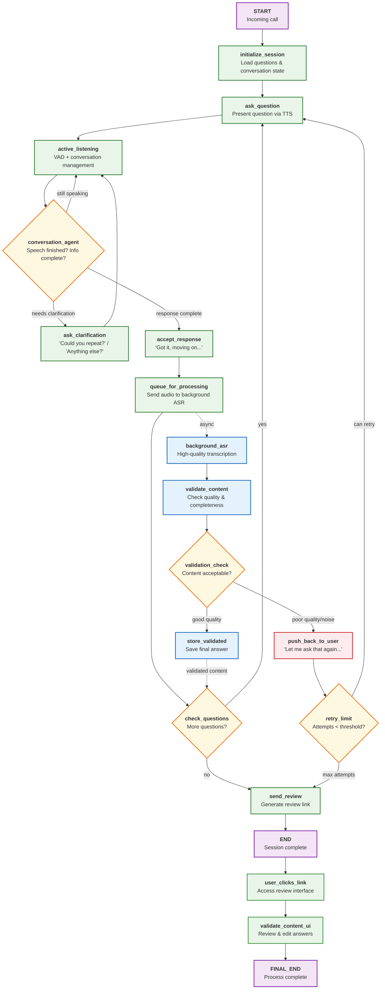
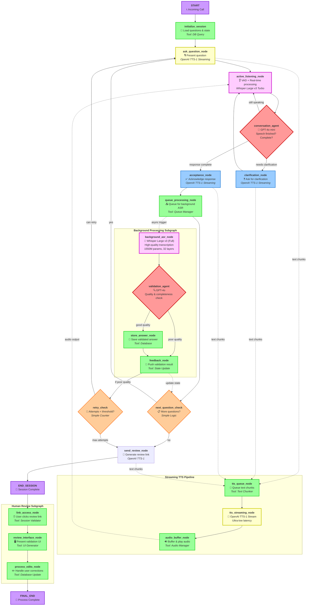

```mermaid
flowchart TD
    %% Main Conversation Flow
    START["`**START**
    Incoming call`"]
    
    INIT["`**initialize_session**
    Load questions & conversation state`"]
    
    ASK["`**ask_question**
    Present question via TTS`"]
    
    LISTEN["`**active_listening**
    VAD + conversation management`"]
    
    CONV_CHECK{"`**conversation_agent**
    Speech finished? Info complete?`"}
    
    CLARIFY["`**ask_clarification**
    'Could you repeat?' / 'Anything else?'`"]
    
    ACCEPT["`**accept_response**
    'Got it, moving on...'`"]
    
    QUEUE_ASR["`**queue_for_processing**
    Send audio to background ASR`"]
    
    NEXT_Q{"`**check_questions**
    More questions?`"}
    
    REVIEW["`**send_review**
    Generate review link`"]
    
    END["`**END**
    Session complete`"]
    
    %% Background Processing & Validation
    BG_ASR["`**background_asr**
    High-quality transcription`"]
    
    BG_VALIDATE["`**validate_content**
    Check quality & completeness`"]
    
    BG_DECIDE{"`**validation_check**
    Content acceptable?`"}
    
    BG_STORE["`**store_validated**
    Save final answer`"]
    
    %% Validation Feedback Loop
    PUSH_BACK["`**push_back_to_user**
    'Let me ask that again...'`"]
    
    RETRY_COUNT{"`**retry_limit**
    Attempts < threshold?`"}
    
    %% Human Review UI Flow
    CLICK_LINK["`**user_clicks_link**
    Access review interface`"]
    
    VALIDATE_UI["`**validate_content_ui**
    Review & edit answers`"]
  
    
    FINAL_END["`**FINAL_END**
    Process complete`"]

    %% Main Flow
    START --> INIT
    INIT --> ASK
    ASK --> LISTEN
    LISTEN --> CONV_CHECK
    
    CONV_CHECK -->|"still speaking"| LISTEN
    CONV_CHECK -->|"needs clarification"| CLARIFY
    CONV_CHECK -->|"response complete"| ACCEPT
    
    CLARIFY --> LISTEN
    ACCEPT --> QUEUE_ASR
    QUEUE_ASR --> NEXT_Q
    
    NEXT_Q -->|"yes"| ASK
    NEXT_Q -->|"no"| REVIEW
    
    REVIEW --> END

    %% Background Validation Flow
    QUEUE_ASR -.->|"async"| BG_ASR
    BG_ASR --> BG_VALIDATE
    BG_VALIDATE --> BG_DECIDE
    
    %% Validation Decision Paths
    BG_DECIDE -->|"good quality"| BG_STORE
    BG_DECIDE -->|"poor quality/noise"| PUSH_BACK
    
    %% Retry Logic
    PUSH_BACK --> RETRY_COUNT
    RETRY_COUNT -->|"can retry"| ASK
    RETRY_COUNT -->|"max attempts"| REVIEW
    
    %% Final States
    BG_STORE -.->|"validated content"| NEXT_Q
    
    %% Human Review Flow
    END --> CLICK_LINK
    CLICK_LINK --> VALIDATE_UI
    VALIDATE_UI --> FINAL_END

    %% Styling
    classDef conversationNode fill:#e8f5e8,stroke:#2e7d32,stroke-width:2px
    classDef backgroundNode fill:#e3f2fd,stroke:#1565c0,stroke-width:2px
    classDef validationNode fill:#ffebee,stroke:#c62828,stroke-width:2px
    classDef decisionNode fill:#fff8e1,stroke:#ef6c00,stroke-width:2px
    classDef systemNode fill:#f3e5f5,stroke:#7b1fa2,stroke-width:2px
    classDef uiNode fill:#e8f5e8,stroke:#388e3c,stroke-width:2px
    
    class INIT,ASK,LISTEN,CLARIFY,ACCEPT,QUEUE_ASR,REVIEW conversationNode
    class BG_ASR,BG_VALIDATE,BG_STORE backgroundNode
    class PUSH_BACK validationNode
    class CONV_CHECK,NEXT_Q,BG_DECIDE,RETRY_COUNT decisionNode
    class START,END,FINAL_END systemNode
    class CLICK_LINK,VALIDATE_UI,EDIT_UI,ACCEPT_UI uiNode
```

```mermaid
flowchart TD
    %% Entry Points
    START["`**START**
    📞 Incoming Call`"]
    
    %% Core LangGraph Nodes
    INIT["`**initialize_session**
    🔧 Load questions & state
    *Tool: DB Query*`"]
    
    ASK["`**ask_question_node**
    🎙️ Present question
    *OpenAI TTS-1 Streaming*`"]
    
    LISTEN["`**active_listening_node**
    👂 VAD + Real-time processing
    *Whisper Large v3 Turbo*`"]
    
    CONV_AGENT{"`**conversation_agent**
    🤖 GPT-4o mini
    Speech finished? Complete?`"}
    
    CLARIFY["`**clarification_node**
    ❓ Ask for clarification
    *OpenAI TTS-1 Streaming*`"]
    
    ACCEPT["`**acceptance_node**
    ✅ Acknowledge response
    *OpenAI TTS-1 Streaming*`"]
    
    QUEUE_NODE["`**queue_processing_node**
    📤 Queue for background ASR
    *Tool: Queue Manager*`"]
    
    NEXT_CHECK{"`**next_question_check**
    📋 More questions?
    *Simple Logic*`"}
    
    REVIEW_NODE["`**send_review_node**
    📨 Generate review link
    *OpenAI TTS-1*`"]
    
    END_SESSION["`**END_SESSION**
    🏁 Session Complete`"]
    
    %% Background Processing Subgraph
    subgraph BACKGROUND ["`**Background Processing Subgraph**`"]
        BG_ASR["`**background_asr_node**
        🎯 Whisper Large v3 (Full)
        High-quality transcription
        1550M params, 32 layers`"]
        
        VALIDATE_AGENT{"`**validation_agent**
        🔍 GPT-4o
        Quality & completeness check`"}
        
        STORE_NODE["`**store_answer_node**
        💾 Save validated answer
        *Tool: Database*`"]
        
        FEEDBACK_NODE["`**feedback_node**
        🔄 Push validation result
        *Tool: State Update*`"]
    end
    
    %% Streaming TTS Subgraph
    subgraph STREAMING_TTS ["`**Streaming TTS Pipeline**`"]
        TTS_QUEUE["`**tts_queue_node**
        📝 Queue text chunks
        *Tool: Text Chunker*`"]
        
        TTS_STREAM["`**tts_streaming_node**
        🎵 OpenAI TTS-1 Stream
        Ultra-low latency`"]
        
        AUDIO_BUFFER["`**audio_buffer_node**
        🔊 Buffer & play audio
        *Tool: Audio Manager*`"]
    end
    
    %% Human Review Subgraph
    subgraph HUMAN_REVIEW ["`**Human Review Subgraph**`"]
        CLICK_LINK["`**link_access_node**
        🖱️ User clicks review link
        *Tool: Session Validator*`"]
        
        REVIEW_UI["`**review_interface_node**
        🖥️ Present validation UI
        *Tool: UI Generator*`"]
        
        PROCESS_EDITS["`**process_edits_node**
        ✏️ Handle user corrections
        *Tool: Database Update*`"]
    end
    
    %% Retry Logic
    RETRY_CHECK{"`**retry_check**
    🔄 Attempts < threshold?
    *Simple Counter*`"}
    
    FINAL_END["`**FINAL_END**
    🎉 Process Complete`"]

    %% Main Flow Connections
    START --> INIT
    INIT --> ASK
    ASK --> LISTEN
    LISTEN --> CONV_AGENT
    
    CONV_AGENT -->|"still speaking"| LISTEN
    CONV_AGENT -->|"needs clarification"| CLARIFY
    CONV_AGENT -->|"response complete"| ACCEPT
    
    CLARIFY --> LISTEN
    ACCEPT --> QUEUE_NODE
    QUEUE_NODE --> NEXT_CHECK
    
    NEXT_CHECK -->|"yes"| ASK
    NEXT_CHECK -->|"no"| REVIEW_NODE
    REVIEW_NODE --> END_SESSION

    %% Streaming TTS Flow
    ASK -.->|"text chunks"| TTS_QUEUE
    CLARIFY -.->|"text chunks"| TTS_QUEUE
    ACCEPT -.->|"text chunks"| TTS_QUEUE
    REVIEW_NODE -.->|"text chunks"| TTS_QUEUE
    
    TTS_QUEUE --> TTS_STREAM
    TTS_STREAM --> AUDIO_BUFFER
    AUDIO_BUFFER -.->|"audio output"| LISTEN

    %% Background Processing Flow
    QUEUE_NODE -.->|"async trigger"| BG_ASR
    BG_ASR --> VALIDATE_AGENT
    VALIDATE_AGENT -->|"good quality"| STORE_NODE
    VALIDATE_AGENT -->|"poor quality"| FEEDBACK_NODE
    
    STORE_NODE --> FEEDBACK_NODE
    FEEDBACK_NODE -.->|"update state"| NEXT_CHECK
    
    %% Retry Logic
    FEEDBACK_NODE -->|"if poor quality"| RETRY_CHECK
    RETRY_CHECK -->|"can retry"| ASK
    RETRY_CHECK -->|"max attempts"| REVIEW_NODE

    %% Human Review Flow
    END_SESSION --> CLICK_LINK
    CLICK_LINK --> REVIEW_UI
    REVIEW_UI --> PROCESS_EDITS
    PROCESS_EDITS --> FINAL_END

    %% Styling
    classDef llmAgent fill:#ff9999,stroke:#cc0000,stroke-width:3px
    classDef chainNode fill:#99ccff,stroke:#0066cc,stroke-width:2px
    classDef toolNode fill:#99ff99,stroke:#00cc00,stroke-width:2px
    classDef decisionNode fill:#ffcc99,stroke:#ff6600,stroke-width:2px
    classDef systemNode fill:#cc99ff,stroke:#6600cc,stroke-width:2px
    classDef whisperNode fill:#ffccff,stroke:#cc00cc,stroke-width:3px
    classDef ttsNode fill:#ffffcc,stroke:#cccc00,stroke-width:3px
    
    class CONV_AGENT,VALIDATE_AGENT llmAgent
    class CLARIFY,ACCEPT chainNode
    class INIT,QUEUE_NODE,STORE_NODE,FEEDBACK_NODE,CLICK_LINK,REVIEW_UI,PROCESS_EDITS,TTS_QUEUE,AUDIO_BUFFER toolNode
    class NEXT_CHECK,RETRY_CHECK decisionNode
    class START,END_SESSION,FINAL_END systemNode
    class LISTEN,BG_ASR whisperNode
    class ASK,TTS_STREAM ttsNode
```

