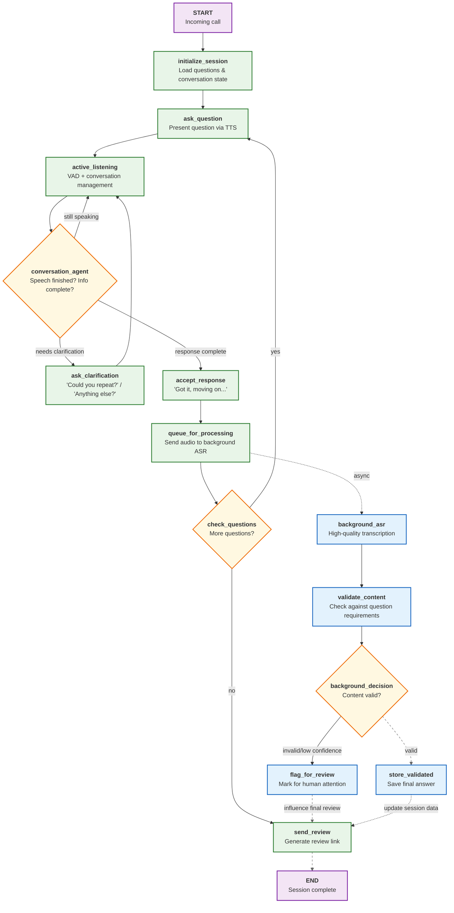

```mermaid
flowchart TD
  %% --- Nodes with rectangles and <br> ---
  Caller_Start["User<br>Incoming call<br>Input: phone → Output: call event (user)"]
  Create_Session["System<br>Create session ID & metadata<br>Input: call → Output: session object (chain)"]
  Retrieve_QA["System<br>Retrieve Q&A script<br>Input: session → Output: list of questions (chain)"]
  Ask_Question["System<br>Select next question<br>Input: list + prev answers → Output: question text (chain)"]
  TTS_Play["System<br>Ask user via TTS<br>Input: question text → Output: audio (LLM)"]
  Caller_Speaks["User<br>Speaks answer<br>Input: heard question → Output: answer audio (user)"]
  Listen_VAD["System<br>Split speech with VAD<br>Input: audio → Output: utterance chunks (chain)"]
  Fast_ASR["Fast ASR<br>Transcribe audio streaming<br>Input: audio → Output: provisional text (LLM)"]
  Validate_Answer["System<br>Validate answer & handle retries<br>Input: text + attempts → Output: validated / retry / escalate (chain)"]
  Persist_Provisional["System<br>Save provisional Q&A<br>Input: validated text → Output: DB row (chain)"]
  Enqueue_Background["System<br>Queue audio for full ASR<br>Input: audio → Output: background job (chain)"]
  Next_Question["System<br>More questions?<br>Input: list/answered → Output: yes/no (chain)"]
  Reask_Question["System<br>Re-ask question if retry needed<br>Input: question → Output: audio (chain)"]
  Escalate_Human["System<br>Flag for human agent<br>Input: max attempts/low confidence → Output: flagged (chain)"]
  Generate_Review["System<br>Generate & send review link<br>Input: final transcripts → Output: message sent (chain)"]
  User_Review["User<br>Review & edit answers<br>Input: message → Output: edited answers (user)"]
  Push_CRM["System<br>Push finalized contact to CRM<br>Input: accepted answers → Output: CRM updated (chain)"]
  End_Session["System<br>End session & log<br>Input: CRM update/flag → Output: session closed (system)"]

  Background_Full_ASR["Background<br>Full transcription + evaluation<br>Input: queued jobs → Output: diff/confidence → retry/escalate/finalize (background)"]

  %% --- Edges ---
  Caller_Start --> Create_Session
  Create_Session --> Retrieve_QA
  Retrieve_QA --> Ask_Question
  Ask_Question --> TTS_Play
  TTS_Play --> Caller_Speaks
  Caller_Speaks --> Listen_VAD
  Listen_VAD --> Fast_ASR
  Fast_ASR --> Validate_Answer
  Validate_Answer -->|valid| Persist_Provisional
  Validate_Answer -->|retry| Reask_Question
  Validate_Answer -->|escalate| Escalate_Human
  Persist_Provisional --> Enqueue_Background
  Enqueue_Background --> Next_Question

  Next_Question -->|yes| Ask_Question
  Next_Question -->|no| Generate_Review

  Reask_Question --> TTS_Play

  Enqueue_Background --> Background_Full_ASR
  Background_Full_ASR -->|retry| Reask_Question
  Background_Full_ASR -->|escalate| Escalate_Human
  Background_Full_ASR -->|finalize| Generate_Review

  Generate_Review --> User_Review
  User_Review -->|accepted| Push_CRM
  User_Review -->|not accepted| Escalate_Human
  Push_CRM --> End_Session
  Escalate_Human --> End_Session

  %% --- Styling ---
  classDef userAction fill:#e6ffed,stroke:#2a9d8f,stroke-width:2px;
  classDef chainNode fill:#fff3e0,stroke:#f2994a,stroke-width:2px;
  classDef llmNode fill:#f0edff,stroke:#7b61ff,stroke-width:2px;
  classDef backgroundNode fill:#e6f0ff,stroke:#2b7cff,stroke-width:2px;
  classDef systemNode fill:#f2f2f2,stroke:#9b9b9b,stroke-width:1.5px;

  class Caller_Start,Caller_Speaks,User_Review,TTS_Play userAction;
  class Create_Session,Retrieve_QA,Ask_Question,Listen_VAD,Validate_Answer,Persist_Provisional,Enqueue_Background,Next_Question,Reask_Question,Escalate_Human,Generate_Review,Push_CRM chainNode;
  class Fast_ASR llmNode;
  class Background_Full_ASR backgroundNode;
  class End_Session systemNode;

  linkStyle default stroke-linecap:round,stroke-width:1.6px;
```

```mermaid
flowchart TD
    %% Main Conversation Flow
    START["`**START**
    Incoming call`"]
    
    INIT["`**initialize_session**
    Load questions & conversation state`"]
    
    ASK["`**ask_question**
    Present question via TTS`"]
    
    LISTEN["`**active_listening**
    VAD + conversation management`"]
    
    CONV_CHECK{"`**conversation_agent**
    Speech finished? Info complete?`"}
    
    CLARIFY["`**ask_clarification**
    'Could you repeat?' / 'Anything else?'`"]
    
    ACCEPT["`**accept_response**
    'Got it, moving on...'`"]
    
    QUEUE_ASR["`**queue_for_processing**
    Send audio to background ASR`"]
    
    NEXT_Q{"`**check_questions**
    More questions?`"}
    
    REVIEW["`**send_review**
    Generate review link`"]
    
    END["`**END**
    Session complete`"]
    
    %% Background Processing
    BG_ASR["`**background_asr**
    High-quality transcription`"]
    
    BG_VALIDATE["`**validate_content**
    Check against question requirements`"]
    
    BG_DECIDE{"`**background_decision**
    Content valid?`"}
    
    BG_FLAG["`**flag_for_review**
    Mark for human attention`"]
    
    BG_STORE["`**store_validated**
    Save final answer`"]

    %% Main Flow
    START --> INIT
    INIT --> ASK
    ASK --> LISTEN
    LISTEN --> CONV_CHECK
    
    CONV_CHECK -->|"still speaking"| LISTEN
    CONV_CHECK -->|"needs clarification"| CLARIFY
    CONV_CHECK -->|"response complete"| ACCEPT
    
    CLARIFY --> LISTEN
    ACCEPT --> QUEUE_ASR
    QUEUE_ASR --> NEXT_Q
    
    NEXT_Q -->|"yes"| ASK
    NEXT_Q -->|"no"| REVIEW
    
    REVIEW --> END

    %% Background Flow (parallel)
    QUEUE_ASR -.->|"async"| BG_ASR
    BG_ASR --> BG_VALIDATE
    BG_VALIDATE --> BG_DECIDE
    
    BG_DECIDE -->|"invalid/low confidence"| BG_FLAG
    BG_DECIDE -->|"valid"| BG_STORE
    
    BG_FLAG -.->|"influence final review"| REVIEW
    BG_STORE -.->|"update session data"| REVIEW

    %% Styling
    classDef conversationNode fill:#e8f5e8,stroke:#2e7d32,stroke-width:2px
    classDef backgroundNode fill:#e3f2fd,stroke:#1565c0,stroke-width:2px
    classDef decisionNode fill:#fff8e1,stroke:#ef6c00,stroke-width:2px
    classDef systemNode fill:#f3e5f5,stroke:#7b1fa2,stroke-width:2px
    
    class INIT,ASK,LISTEN,CLARIFY,ACCEPT,QUEUE_ASR,REVIEW conversationNode
    class BG_ASR,BG_VALIDATE,BG_STORE,BG_FLAG backgroundNode
    class CONV_CHECK,NEXT_Q,BG_DECIDE decisionNode
    class START,END systemNode

    %% Style async connections
    linkStyle 12 stroke:#666,stroke-dasharray: 5 5
    linkStyle 17 stroke:#666,stroke-dasharray: 5 5  
    linkStyle 18 stroke:#666,stroke-dasharray: 5 5
```

