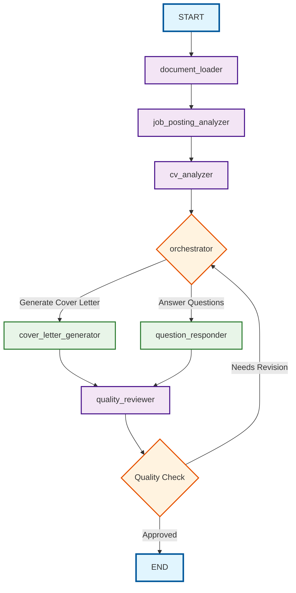

# LangGraph Job Application Assistant - Node Specifications




# 

## State Structure

```python
class JobSearchState(MessagesState):
    job_posting: str              # Raw job posting content
    cv_content: str              # Loaded CV markdown content
    job_analysis_report: str     # Structured analysis of job requirements
    cv_analysis_report: str      # Gap analysis between CV and job
    cover_letter: str           # Generated cover letter
    qa_response: str            # Response to specific questions
    quality_review: str         # Quality assessment and feedback
    current_task: str           # Current operation: "analyze_job", "generate_cover", "answer_question"
    templates: dict             # Cover letter templates and configurations
    user_preferences: dict      # User styling and format preferences
```

## Node Specifications

### 1. Document Loader

**Purpose**: Initial data loading and validation node

**Responsibilities**:

- Load CV markdown from designated folder
- Validate job posting input from user
- Load cover letter templates and configurations
- Perform initial format validation

**Inputs**:

- User-provided job posting
- CV file path configuration

**Outputs**:

- Populated `cv_content` and `job_posting` in state
- Loaded `templates` dictionary

**Error Handling**:

- Missing CV file
- Invalid job posting format
- Template loading failures

------

### 2. Job Posting Analyzer

**Purpose**: Extract and structure job requirements

**Responsibilities**:

- Parse job requirements, skills, and qualifications
- Identify company culture and values
- Extract key responsibilities and expectations
- Determine application format requirements
- Analyze industry and role context

**Inputs**:

- `job_posting` from state

**Outputs**:

- Structured `job_analysis_report` containing:
  - Required skills (technical/soft)
  - Company information
  - Role responsibilities
  - Application requirements
  - Industry context

**LLM Prompt Focus**:

- Systematic requirement extraction
- Priority ranking of skills
- Cultural fit indicators

------

### 3. CV Analyzer

**Purpose**: Perform gap analysis between CV and job requirements

**Responsibilities**:

- Compare CV skills against job requirements
- Identify strengths and matching points
- Highlight gaps and potential concerns
- Suggest positioning strategies
- Extract relevant experience for emphasis

**Inputs**:

- `cv_content` and `job_analysis_report` from state

**Outputs**:

- Comprehensive `cv_analysis_report` containing:
  - Skills match percentage
  - Key selling points
  - Gap analysis
  - Recommended positioning
  - Experience relevance mapping

**Analysis Framework**:

- Technical skill alignment
- Experience relevance scoring
- Cultural fit assessment
- Growth potential indicators

------

### 4. Orchestrator

**Purpose**: Central coordination and task routing

**Responsibilities**:

- Determine next action based on user input
- Route to appropriate generator node
- Manage workflow state transitions
- Handle user interaction and commands
- Coordinate revision cycles

**Decision Logic**:

- **Cover Letter Generation**: Route to `cover_letter_generator`
- **Question Answering**: Route to `question_responder`
- **Analysis Update**: Loop back to analyzers
- **Quality Issues**: Coordinate revisions

**Inputs**:

- All state data
- User commands and preferences

**Outputs**:

- Updated `current_task`
- Routing decisions

------

### 5. Cover Letter Generator

**Purpose**: Create tailored cover letters

**Responsibilities**:

- Generate personalized cover letter content
- Integrate job-specific requirements
- Highlight relevant CV experiences
- Apply appropriate tone and formatting
- Customize based on company culture

**Inputs**:

- `job_analysis_report`
- `cv_analysis_report`
- `templates`
- `user_preferences`

**Outputs**:

- Complete `cover_letter` with:
  - Personalized introduction
  - Relevant experience highlights
  - Company-specific motivation
  - Professional closing
  - Proper formatting

**Generation Strategy**:

- Template-based customization
- Dynamic content insertion
- Tone adaptation
- Length optimization

------

### 6. Question Responder

**Purpose**: Handle specific application questions

**Responsibilities**:

- Process user questions about the application
- Provide specific, contextual answers
- Reference CV and job analysis
- Offer strategic advice
- Generate interview preparation content

**Inputs**:

- User question
- All analysis reports
- CV content

**Outputs**:

- Detailed `qa_response` with:
  - Direct answer to question
  - Supporting reasoning
  - Relevant examples from CV
  - Strategic recommendations

**Question Categories**:

- Salary negotiation guidance
- Interview preparation
- Application strategy
- Skill development advice

------

### 7. Quality Reviewer

**Purpose**: Final quality assurance and improvement

**Responsibilities**:

- Review all generated content for quality
- Check for consistency and accuracy
- Verify requirement alignment
- Assess professional tone and formatting
- Provide improvement recommendations

**Inputs**:

- Generated content (`cover_letter` or `qa_response`)
- All analysis reports
- Original requirements

**Outputs**:

- `quality_review` containing:
  - Quality score (1-10)
  - Specific feedback points
  - Improvement suggestions
  - Approval/revision recommendation

**Quality Criteria**:

- Content accuracy and relevance
- Professional tone and language
- Requirement coverage
- Formatting and structure
- Personalization level

------

## Error Handling & Edge Cases

### Common Error Scenarios

- **Missing Documents**: Graceful fallback to manual input
- **Invalid Job Postings**: Request clarification or reformatting
- **Analysis Failures**: Retry with simplified prompts
- **Quality Issues**: Automatic revision loop with user feedback

### Performance Considerations

- **Caching**: Store analysis results for reuse
- **Parallel Processing**: Run independent analyses concurrently
- **Token Management**: Optimize prompt lengths for cost efficiency
- **Rate Limiting**: Handle API limitations gracefully

## Configuration Options

### User Preferences

```python
user_preferences = {
    "cover_letter_length": "medium",  # short, medium, long
    "tone": "professional",           # casual, professional, enthusiastic
    "format": "traditional",          # modern, traditional, creative
    "language": "french",            # english, french, bilingual
    "export_format": "markdown"      # markdown, pdf, docx
}
```

### Template System

- Multiple cover letter templates
- Industry-specific variations
- Customizable sections and blocks
- Dynamic content placeholders